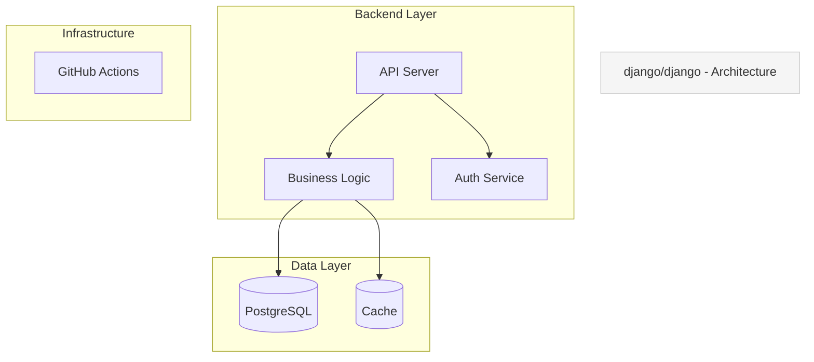
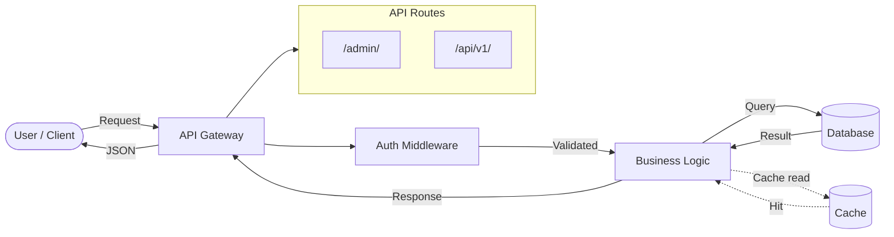
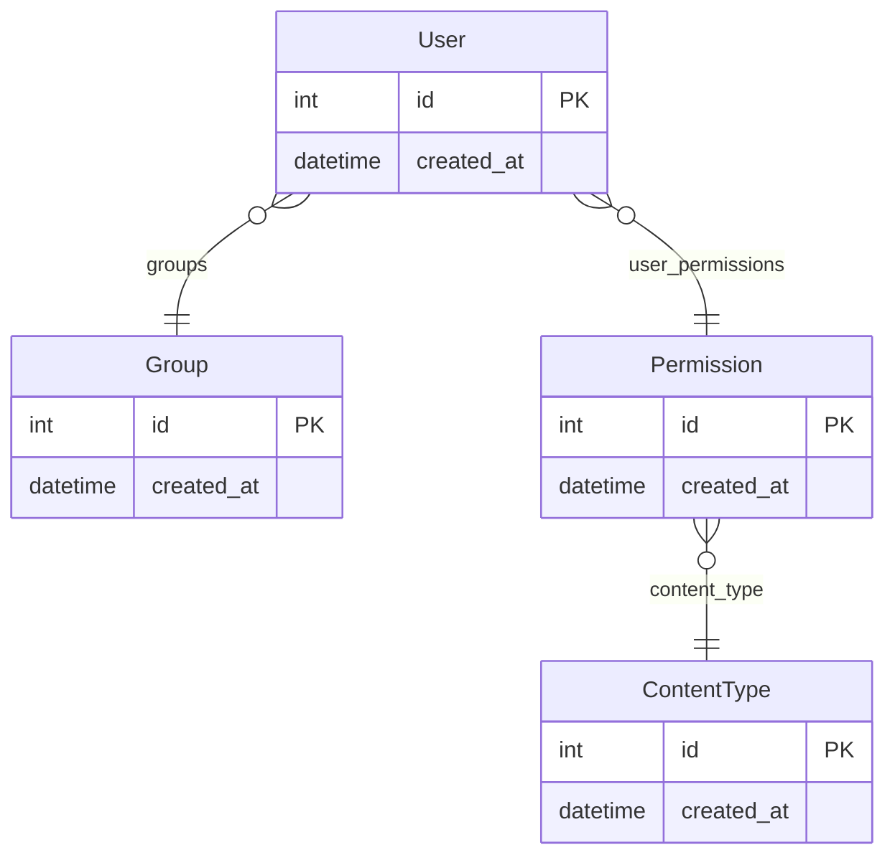
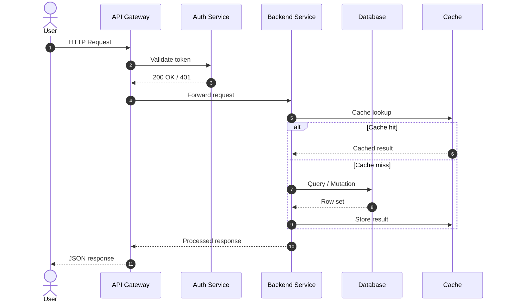
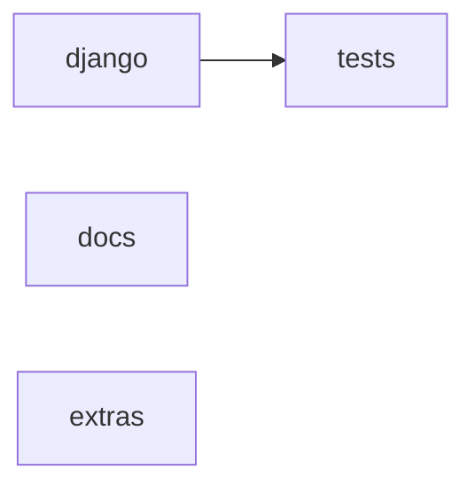
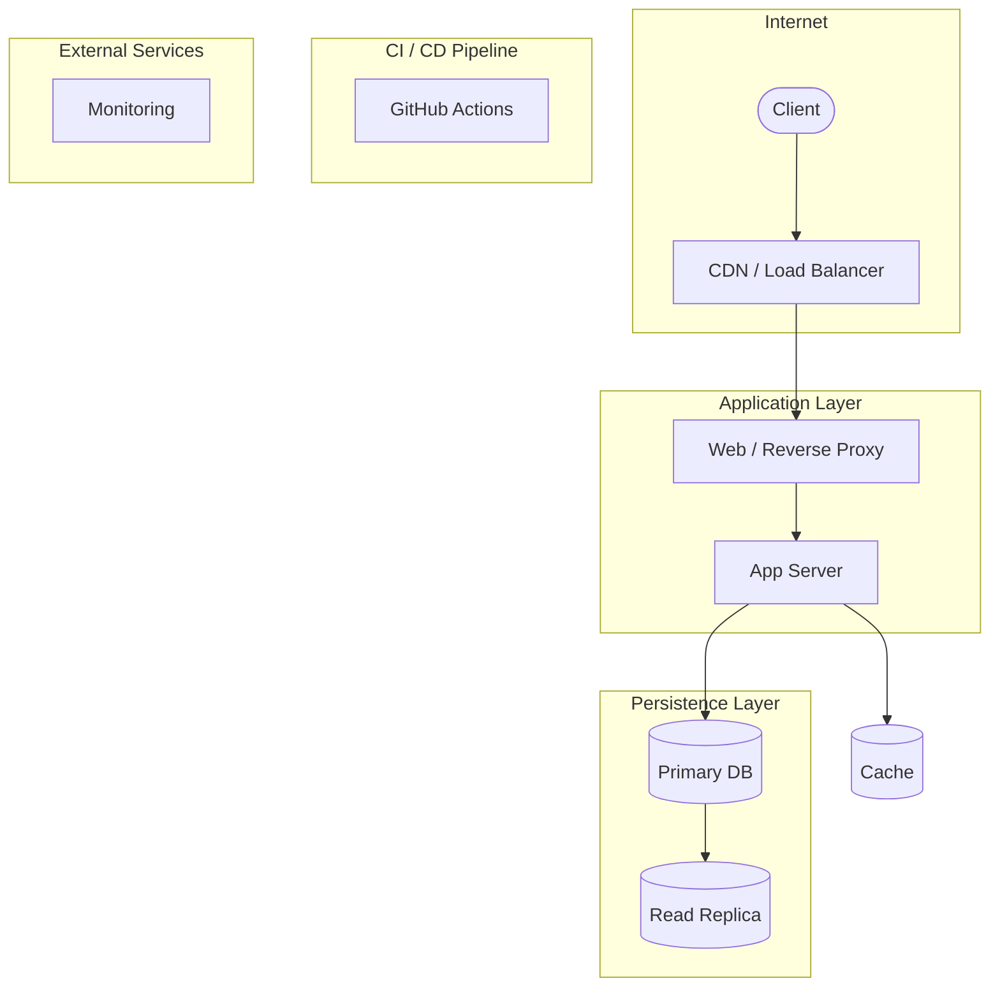

# Sample Output — `django/django`

This shows the output of `analyze_repository` run on the Django framework repo.

---

## 1. System Architecture

---

## 2. Data Flow

---

## 3. Entity-Relationship Diagram

---

## 4. Sequence Diagram

---

## 5. Component Map

---

## 6. Deployment Topology

